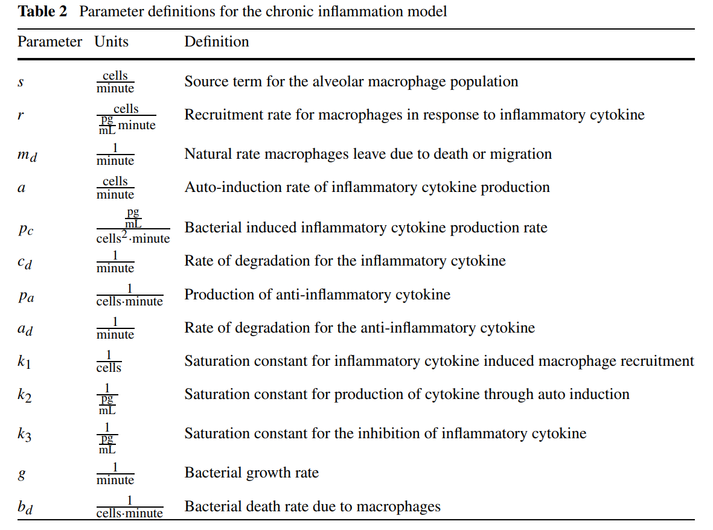

```{r setup, include=FALSE}
knitr::opts_chunk$set(echo = TRUE,fig.width = 5,fig.height=3)
library(mosaic)
library(mosaicCalc)
library(deSolve)
library(ggplot2)
```


#Problems 1,2,3
```{r}
x1 <- seq(0,3,length.out = 101)
y1 <- x1/(1+x1)
y2 <- (x1^2)/(1+x1^2)
y3 <- (x1^3)/(1+x1^3)
ggplot(data=data.frame(y1=y1,y2=y2,y3=y3,x1=x1)) + 
  geom_line(aes(x=x1,y=y1)) + 
  geom_line(aes(x=x1,y=y2)) + 
  geom_line(aes(x=x1,y=y3))
```

As $n$ increases for the function $f(x) = \frac{x^n}{1+x^n}$ where $n$ is a positive integer, the function has the same values for $f(0)=0, f(x)=1$ as $x \rightarrow \infty$ with differing behavior in between. More specifically, $f(x)$ is lesser near $x=0$ and greater near $x=1,2,3...$ as $n$ increases. Intuitively, as $n$ increases the $+1$ term in the denominator becomes more or less "impactful" to the resulting ratio depending on whether $x>1$ or $x<1$; as $x$ increases with $x>1, n \text{ large}$, the resulting value approaches 1 faster since the $x^n$ value departs from $1$ significantly faster.

#Problem 4
Given $\frac{dx}{dt}= \Phi (t) - \lambda x$ and $y=f(x)$,
##a)
$$
\begin{split}
  &\text{Known: } \\
  x&=f^{-1}(y) \\
  \frac{dy}{dx}&=f'(f^{-1}(y))
\end{split}
    \quad \quad \quad 
\begin{split}
  \text{} \\
  \frac{dy}{dt} &= \frac{dy}{dx}\frac{dx}{dt}\\
  &=f'(f^{-1}(y)) * \Big[ \Phi (t)- \lambda x \Big]\\
  &=f'(f^{-1}(y))\Big[ \Phi (t)- \lambda f^{-1}(y) \Big]
\end{split}
$$

##b)
Considering the particular case $y=f(x)=\frac{x}{k+x}$:

###i)
Finding $x=f^{-1}(y)$:
$$
\begin{aligned}
y&=\frac{x}{k+x}\\
x &= yk+yx \\
yk &= x-yx=x(1-y) \\
x &= \frac{yk}{1-y}
\end{aligned}
$$

###ii)
Finding $f'(x)$:
$$
f'(x)=\frac{d}{dx}\frac{x}{k+x}=\frac{k}{(k+x)^2}
$$

###iii)
Finding $f'(f^{-1}(y))$:
$$
\begin{aligned}
f'(f^{-1}(y))&= \frac{k}{{\Big( k+f^{-1}(y)\Big)^2}} =
\frac{k}{k^2+\frac{2yk^2}{(1-y)}+\frac{y^2k^2}{(1-y)^2}}\\
&= \frac{k(1-y)^2}{k^2(1-y)^2 + 2yk^2(1-y)+y^2k^2} \\
&= \frac{k(1-y)^2}{k^2-2k^2y+k^2y^2 + 2yk^2-2y^2k^2+y^2k^2} = \frac{(1-y)^2}{k}
\end{aligned}
$$

###iv)
Finding $\frac{dy}{dt}$:
$$
\begin{aligned}
\frac{dy}{dt} = \frac{dy}{dx}\frac{dx}{dt} &= f'(f^{-1}(y))\Big[ \Phi (t)- \lambda f^{-1}(y) \Big] \\
&= \frac{(1-y)^2}{k}\Big[ \Phi (t) -\lambda \frac{yk}{(1-y)}\Big] \\
&= (1-y) \Big[ \Phi (t) \frac{(1-y)}{k} -\lambda y \Big] \\
&= (1-y) \Big[  \frac{\Phi (t)}{k} - \Big( \lambda + \frac{\Phi (t)}{k} \Big) y \Big]
\end{aligned}
$$

###v)
Solving $\frac{dy}{dt}$ with $\Phi \equiv 0$:
$$
\begin{aligned}
\frac{dy}{dt} 
&= (1-y) \Big[  \frac{\Phi (t)}{k} - \Big( \lambda + \frac{\Phi (t)}{k} \Big) y \Big] \\
&=  \lambda y (y-1) \\
\text{Using separa} & \text{tion of variables:} \\
\int \frac{1}{y(y-1)} dy &= \int \lambda dt \\
\ln \Big( \frac{1}{y}-1 \Big) &= \lambda t + C \\
\frac{1}{y}-1 &= Ce^{\lambda t} \\
y &= \frac{1}{Ce^{\lambda t} +1}
\end{aligned}
$$

##c)
Derive $\frac{dy}{dt}$ with $f(x)=\frac{x^h}{k^h+x^h}$:

###i)
Finding $x=f^{-1}(y)=...$

$$
\begin{aligned}
y&=\frac{x^h}{k^h+x^h}\\
x^h &= yk^h+yx^h \\
yk^h &= x^h-yx^h=x^h(1-y) \\
x &= \sqrt[h]{\frac{yk^h}{1-y}}
\end{aligned}
$$

###ii)
Finding $f'(x)$ using quotient rule:
$$
\begin{aligned}
f'(x)&=\frac{d}{dx}\frac{x^h}{k^h+x^h} \\
&=\frac{hx^{h-1}(k^h+x^h)-hx^{h-1}x^h}{(k^h+x^h)^2} \\
&= \frac{hx^{h-1}k^h + hx^{h-1}x^h-hx^{h-1}x^h}{k^{2h}+2x^hk^h+x^{2h}} \\
f'(x)&= \frac{hk^hx^{h-1}}{k^{2h}+2x^hk^h+x^{2h}}
\end{aligned}
$$

###iii)
Finding $f'(f^{-1}(y))$
$$
\begin{aligned}
f'(f^{-1}(y))&= 
\frac{hk^h {\sqrt[h]{\frac{yk^h}{1-y}}}^{h-1}}
{k^{2h}+2{\sqrt[h]{\frac{yk^h}{1-y}}}^hk^h+{\sqrt[h]{\frac{yk^h}{1-y}}}^{2h}} \\
&=
\frac{hk^h \Big({\frac{yk^h}{1-y}}\Big)^\frac{h-1}{h}}
{k^{2h}+2\Big({\frac{yk^h}{1-y}}\Big) k^h+\Big({\frac{yk^h}{1-y}}\Big)^2} \\
&=
\frac{hk^{2h-1} y^\frac{h-1}{h}({1-y})^{-\frac{h-1}{h}}}
{k^{2h}+2yk^{2h}(1-y)^{-1}+y^2k^{2h}(1-y)^{-2}} \\
&=
\frac{hk^{-1} y^\frac{h-1}{h}({1-y})^{\frac{h+1}{h}}}
{(1-y)^2+2y(1-y)+y^2} \\
&=
\frac{hk^{-1} y^\frac{h-1}{h}({1-y})^{\frac{h+1}{h}}}
{1-2y+y^2+2y-2y^2+y^2} \\
f'(f^{-1}(y))&=hk^{-1} y^\frac{h-1}{h}({1-y})^{\frac{h+1}{h}}
\end{aligned}
$$

###iv)
Finding $\frac{dy}{dt}$:
$$
\begin{aligned}
\frac{dy}{dt} = \frac{dy}{dx}\frac{dx}{dt} &= f'(f^{-1}(y))\Big[ \Phi (t)- \lambda f^{-1}(y) \Big] \\
&= hk^{-1} y^\frac{h-1}{h}({1-y})^{\frac{h+1}{h}}\Big[ \Phi (t) -\lambda \sqrt[h]{\frac{yk^h}{1-y}}\Big] \\
&= hk^{-1} y^\frac{h-1}{h}({1-y})^{\frac{h+1}{h}}\Big[ \Phi (t) -\lambda y^{\frac{1}{h}}k(1-y)^{-\frac{1}{h}}\Big] \\
&= hk^{-1} y^\frac{h-1}{h}({1-y})^{\frac{h+1}{h}} \Phi(t) - \lambda h y (1-y)\\
&= hk^{-1} y^\frac{h-1}{h}({1-y})^{\frac{h+1}{h}} \Phi(t) + \lambda h y^2 - \lambda h y
\end{aligned}
$$

#Problem 5
Write the rate equations governed by the given system.
$$
\begin{aligned}
\frac{dS}{dt} &= -SEk_1 + Ck_2\\
\frac{dC}{dt} &= SEk_1-Ck_2-Ck_3 =-\frac{dS}{dt}-Ck_3\\
\frac{dP}{dt} &= Ck_3\\
\frac{dE}{dt} &= Ck_3-SEk_1 + Ck_2 = \frac{dP}{dt} + \frac{dS}{dt}
\end{aligned}
$$

#Problem 6
Write the rate equations governed by the given system.
$$
\begin{aligned}
\frac{dX}{dt} &= k_1-Xk_3+Yk_2 \\
\frac{dY}{dt} &= Xk_3-Yk_2+Zk_4-Yk_5-3Yk_6     &&= Xk_3-Y(k_2+k_5+k_6) + Zk_4 \\
\frac{dZ}{dt} &= Yk_5-Xk_4+\frac{1}{3}Yk_6-k_7 &&= Y(k_5+\frac{1}{3}k_6)-Zk_4-k_7
\end{aligned}
$$


#Problem 7
State the dimensions of $\alpha, \beta, \gamma$ where $\alpha, \beta, \gamma$ positive and $\beta > 2 \gamma \lambda$ in the following equation:

$$
\begin{aligned}
\frac{dx}{dt} &= \alpha y +\beta \frac{x^2}{\gamma ^2 + x^2}- \lambda x
\\
\Big[ \frac{dx}{dt} \Big] &= 
\big[ \alpha y \big]  =
\Big[\beta \frac{x^2}{\gamma ^2 + x^2} \Big] = 
\Big[ \lambda x \Big] = 
\frac{\text{concentration}}{\text{time}}
\\
\big[ x \big] &= \text{concentration}, 
\big[ y \big] = \text{concentration} 
\\
\big[ \alpha \big] &= \frac{\text{concentration}}{\text{time}} *
\frac{1}{\text{concentration}} = \frac{1}{\text{time}}
\\
\big[ \gamma \big] &= \text{concentration}
\\
\big[ \beta \big] &= \frac{\text{concentration}}{\text{time}} , 
\text{ becuase } \Big[ \gamma^2 + x^2 \Big] = \text{concentration}^2,
\Big[ \frac{x^2}{\gamma^2 + x^2} \Big] = 1
\\
\big[ \lambda \big] &= \frac{1}{\text{time}}
\end{aligned}
$$

#Problem 8
Determine all dimensions of variables in equations (1)-(4) in the model of inflammation paper:
$$
\begin{aligned}
\big[ M \big] &= \text{population (alveolar macrophage)} 
= \text{cells}
&& \Big[ \frac{dM}{dt} \Big] = \frac{\text{population}}{\text{time}}
=\frac{\text{cells}}{\text{minute}}
\\
\big[ C \big] &= \text{concentration (inflammatory cytokines)}
=\frac{pg}{mL}
&&\Big[ \frac{dC}{dt} \Big] = \frac{\text{concentration}}{\text{time}}
=\frac{pg}{mL*\text{minute}}
\\
\big[ A \big] &= \text{concentration (anti-inflammatory cytokines)} =\frac{pg}{mL}
&& \Big[ \frac{dA}{dt} \Big] = \frac{\text{concentration}}{\text{time}}
=\frac{pg}{mL*\text{minute}}
\\
\big[ B \big] &= \text{population (generic pathogen)} = \text{cells} 
&& \Big[ \frac{dB}{dt} \Big] = \frac{\text{population}}{\text{time}}
=\frac{\text{cells}}{\text{minute}}
\\
\end{aligned}
$$



#Problem 9
Nondimensionalize $\frac{dN}{dt}=rN^2(1-\frac{N}{K})$ with $x=\frac{N}{K}$, $\tau =rKt$:
$$
\begin{aligned}
\frac{dX}{d \tau} &= \frac{dX}{dN}\frac{dN}{dt}\frac{dt}{d \tau} \\
\frac{dX}{dN}= \frac{1}{K}, \quad \frac{dN}{dt} &= rN^2\Big(1-\frac{N}{K}\Big), \quad \frac{dt}{d \tau} = \frac{1}{rK} \\
\frac{dX}{d \tau} &= \frac{1}{K} * \frac{1}{rK} * rN^2\Big(1-\frac{N}{K}\Big) \\
&= \frac{N^2}{K^2}\Big(1-\frac{N}{K}\Big)\\
\frac{dX}{d \tau}&= X^2\big( 1-X\big)\\
\end{aligned}
$$
Equilibria values are those values of $X$ that satisfy $\frac{dX}{d\tau}=0$:
$$
\frac{dX}{d \tau}= X^2\big( 1-X\big)\\
X=0,1
$$
We examine the behavior of the second derivative $\frac{d^2X}{d\tau ^2}$ at $X=0,1$ to determine stability of equilibira values:  
* For $X=0$,  $\frac{d^2X}{d\tau ^2}=0$ and this gives us no information.  
* For $X=1$,  $\frac{d^2X}{d\tau ^2}<0$ and we know this is a stable equilibrium.


